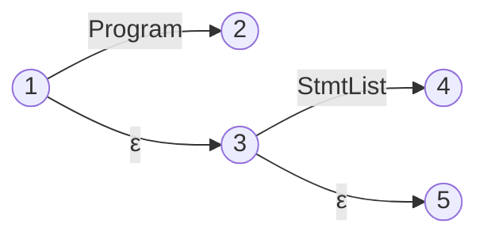

# NFA Stmt

+ $S -> dot "<Program>"$
+ $S -> "<Program>" dot$
+ $"<Program>" -> dot "<StmtList>"$
+ $"<Program>" -> "<StmtList>" dot$
+ $"<StmtList>" -> dot "<Stmt>" "<StmtList>"$
+ $"<StmtList>" -> "<Stmt>" dot "<StmtList>"$
+ $"<StmtList>" -> "<Stmt>" "<StmtList>" dot$
+ $"<StmtList>" -> dot$
+ $"<Stmt>" -> dot "<FuncDecl>"$
+ $"<Stmt>" -> "<FuncDecl>" dot$
+ $"<Stmt>" -> dot "{" "<StmtList>" "}"$
+ $"<Stmt>" -> "{" dot "<StmtList>" "}"$
+ $"<Stmt>" -> "{" "<StmtList>" dot "}"$
+ $"<Stmt>" -> "{" "<StmtList>" "}" dot$
+ $"<Stmt>" -> dot "<CtrlFlow>"$
+ $"<Stmt>" -> "<CtrlFlow>" dot$
+ $"<CtrlFlow>" -> dot "if" "(" "<Expr>" ")" "<Stmt>" "<ElseOpt>"$
+ $"<CtrlFlow>" -> "if" dot "(" "<Expr>" ")" "<Stmt>" "<ElseOpt>"$
+ $"<CtrlFlow>" -> "if" "(" dot "<Expr>" ")" "<Stmt>" "<ElseOpt>"$
+ $"<CtrlFlow>" -> "if" "(" "<Expr>" dot ")" "<Stmt>" "<ElseOpt>"$
+ $"<CtrlFlow>" -> "if" "(" "<Expr>" ")" dot "<Stmt>" "<ElseOpt>"$
+ $"<CtrlFlow>" -> "if" "(" "<Expr>" ")" "<Stmt>" dot "<ElseOpt>"$
+ $"<CtrlFlow>" -> "if" "(" "<Expr>" ")" "<Stmt>" "<ElseOpt>" dot$
+ $"<ElseOpt>" -> dot "else" "<Stmt>"$
+ $"<ElseOpt>" -> "else" dot "<Stmt>"$
+ $"<ElseOpt>" -> "else" "<Stmt>" dot$
+ $"<ElseOpt>" -> dot$
+ $"<FuncDecl>" -> dot "function" "<Ident>" "(" "<FormalParamsOpt>" ")" "{" "<StmtList>" "}"$
+ $"<FuncDecl>" -> "function" dot "<Ident>" "(" "<FormalParamsOpt>" ")" "{" "<StmtList>" "}"$
+ $"<FuncDecl>" -> "function" "<Ident>" dot "(" "<FormalParamsOpt>" ")" "{" "<StmtList>" "}"$
+ $"<FuncDecl>" -> "function" "<Ident>" "(" dot "<FormalParamsOpt>" ")" "{" "<StmtList>" "}"$
+ $"<FuncDecl>" -> "function" "<Ident>" "(" "<FormalParamsOpt>" dot ")" "{" "<StmtList>" "}"$
+ $"<FuncDecl>" -> "function" "<Ident>" "(" "<FormalParamsOpt>" ")" dot "{" "<StmtList>" "}"$
+ $"<FuncDecl>" -> "function" "<Ident>" "(" "<FormalParamsOpt>" ")" "{" dot "<StmtList>" "}"$
+ $"<FuncDecl>" -> "function" "<Ident>" "(" "<FormalParamsOpt>" ")" "{" "<StmtList>" dot "}"$
+ $"<FuncDecl>" -> "function" "<Ident>" "(" "<FormalParamsOpt>" ")" "{" "<StmtList>" "}" dot$

