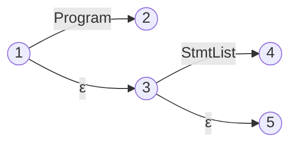

# NFA Stmt

<!-- 1. $S -> dot "<Program>"$
2. $S -> "<Program>" dot$

3. $"<Program>" -> dot "<StmtList>"$
4. $"<Program>" -> "<StmtList>" dot$

5. $"<StmtList>" -> dot "<Stmt>" "<StmtListTail>"$
6. $"<StmtList>" -> "<Stmt>" dot "<StmtListTail>"$
7. $"<StmtList>" -> "<Stmt>" "<StmtListTail>" dot$

8. $"<StmtListTail>" -> dot "<Stmt>" "<StmtListTail>"$
9. $"<StmtListTail>" -> "<Stmt>" dot "<StmtListTail>"$
10. $"<StmtListTail>" -> "<Stmt>" "<StmtListTail>" dot$

11. $"<StmtListTail>" -> dot$

12. $"<Stmt>" -> dot "<FuncDecl>"$
13. $"<Stmt>" -> "<FuncDecl>" dot$

14. $"<Stmt>" -> dot "{" "<StmtList>" "}"$
15. $"<Stmt>" -> "{" dot "<StmtList>" "}"$
16. $"<Stmt>" -> "{" "<StmtList>" dot "}"$
17. $"<Stmt>" -> "{" "<StmtList>" "}" dot$

18. $"<FuncDecl>" -> dot "function" "<Ident>" "(" "<FormalParamsOpt>" ")" "{" "<StmtList>" "}"$
19. $"<FuncDecl>" -> "function" dot "<Ident>" "(" "<FormalParamsOpt>" ")" "{" "<StmtList>" "}"$
20. $"<FuncDecl>" -> "function" "<Ident>" dot "(" "<FormalParamsOpt>" ")" "{" "<StmtList>" "}"$
21. $"<FuncDecl>" -> "function" "<Ident>" "(" dot "<FormalParamsOpt>" ")" "{" "<StmtList>" "}"$
22. $"<FuncDecl>" -> "function" "<Ident>" "(" "<FormalParamsOpt>" dot ")" "{" "<StmtList>" "}"$
23. $"<FuncDecl>" -> "function" "<Ident>" "(" "<FormalParamsOpt>" ")" dot "{" "<StmtList>" "}"$
24. $"<FuncDecl>" -> "function" "<Ident>" "(" "<FormalParamsOpt>" ")" "{" dot "<StmtList>" "}"$
25. $"<FuncDecl>" -> "function" "<Ident>" "(" "<FormalParamsOpt>" ")" "{" "<StmtList>" dot "}"$
26. $"<FuncDecl>" -> "function" "<Ident>" "(" "<FormalParamsOpt>" ")" "{" "<StmtList>" "}" dot$ -->

